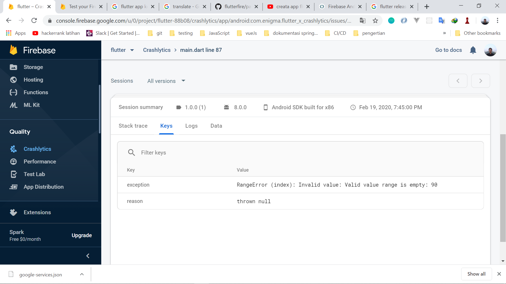

# flutter_x_crashlytics

This is a demo app and containing some `simple scenario for crash reporting using Crashlytics tool by Firebase.`

## Crash
`Crash` is a state where a software --an application software or operating system-- is not properly running. In some cases, Craah can leads applications to close forcefully.

Ketika Mobile apps sudah dirilis ke publik dan masih memiliki suatu bug atau issue yang menyebabkan Mobile apps tersebut crash dapat menyebabkan pengguna meng-uninstal atau bahkan menulis review negatif pada App Store atau mungkin akan mempostingnya di sosial media.

## Crashlytics
Firebase `Crashlytics` Firebase Crashlytics helps you track, prioritize, and fix stability issues that erode app quality, in realtime. Spend less time triaging and troubleshooting crashes and more time building app features that delight users. Crash are grouped by method and line exception, with some warnings which tell us where is the root cause from an exception.

## Getting Started

Here's to help you with Flutter : 
- [Flutter Installation](https://flutter.dev/docs/get-started/install)

Once Flutter is set on your PC, you will need to get firebase and crashlytics added into your Flutter projects :
- [Add Firebase to Flutter Projects](https://firebase.google.com/docs/flutter/setup?platform=android)
- [Add Crashlytics to Flutter Projects](https://pub.dev/packages/firebase_crashlytics)

Here's some helping links :
- [Official sample flutter project from firebase](https://github.com/FirebaseExtended/flutterfire/tree/master/packages/firebase_crashlytics/example)
- [Find keystore and add it to firebase project](https://codelabs.developers.google.com/codelabs/firebase-android/#4)
- [Stackoverflow : Flutter Crashlytics log caught exception](https://stackoverflow.com/questions/57997416/flutter-crashlytics-log-caught-exception)

## What became `highlight` to work with Crashlytics
- Issues Tab :
  - where issue actually happened --filename/classname followed by line of error--, you'll find it under `Issues`
  - Details => contains the type of error, which fatal or non fatal
```
Fatal    : This type of error should be on the top of bug fixing list, since it can affects application to have bad performance and bad user experience, or in a worst case, application is stopped. 
Nonfatal : A tolerable error, will not stop the application but still can cause bad user experience.
```
  - Which application version contains the error, you'll find it under 'Versions'
  - how often the crash happened, you'll find it under `Events`
  - how many peope are being affected, you'll find it under `Users`
  
  
## Example result

Here's the example of error out of bound  
##### crash reporting 

## What's next?
share the issue via social-media or with your team members
