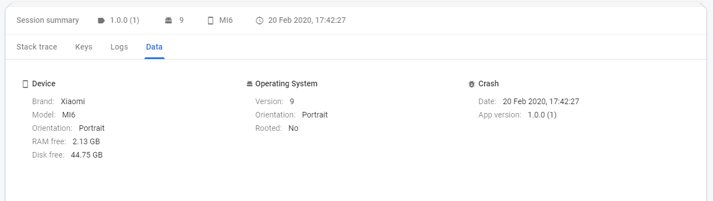
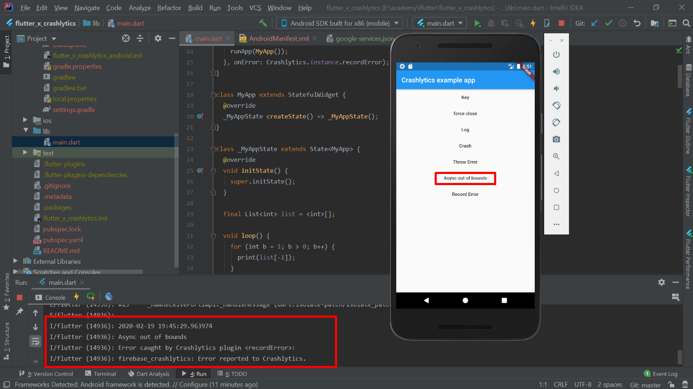

# flutter_x_crashlytics

This is a demo app and containing some `Simple Scenario for Crash Reporting Using Crashlytics Tool by Firebase.`

##
##Fundamentals
#### Crash
`Crash` is a state where a software --an application software or operating system-- is not properly running. In some cases, Craah can leads applications to close forcefully.

#### Firebase Crashlytics
`Firebase Crashlytics` helps you track, prioritize, and fix stability issues that erode app quality, in realtime. Spend less time triaging and troubleshooting crashes and more time building app features that delight users. Crash are grouped by method and line exception, with some warnings which tell us where is the root cause from an exception.

##
## Getting Started

Here's to help you with Flutter : 
- [Flutter Installation](https://flutter.dev/docs/get-started/install)

Once Flutter is set on your PC, you will need to get firebase and crashlytics added into your Flutter project :
- [Add Firebase to Flutter Projects](https://firebase.google.com/docs/flutter/setup?platform=android)
- [Add Crashlytics to Flutter Projects](https://pub.dev/packages/firebase_crashlytics)

Here's some helping links :
- [Official sample flutter project from firebase](https://github.com/FirebaseExtended/flutterfire/tree/master/packages/firebase_crashlytics/example)
- [Find keystore and add it to firebase project](https://codelabs.developers.google.com/codelabs/firebase-android/#4)
- [Stackoverflow : Flutter Crashlytics log caught exception](https://stackoverflow.com/questions/57997416/flutter-crashlytics-log-caught-exception)

##
## Crashlytics Highlights
#### Here are`Highlight`'s to Work with Crashlytics 
- ##### Issues Tab 
    (You will be able to find this screen, just right after you click Crashlytics on sidebar)
  - `Issues`   => where issue actually happened --filename/classname followed by line of error--
  - `Versions` => Which application version contains the error
  - `Events`   => how often the crash happened
  - `Users`    => how many peope are being affected
  - `Details`  => contains the type of error, which fatal or non fatal
```
Fatal    : This type of error should be on the top of bug fixing list, since it can affects application to have bad performance and bad user experience, or in a worst case, application is stopped. 
```
```
Nonfatal : A tolerable error, will not stop the application but still can cause bad user experience.
```

#### Issue tab in Firebase Console
Issues Tab

 
Issues Graphical View


#### Session tab in Firebase Console

- ##### Sessions Tab :
    (You will be able to find this screen,  when you click on one of issues)

  - `Stack Trace`   => Provide stack trace of an error
  - `Keys`          => If in you set `Crashlytics.instance.setString(someKey)` in your code, this will create a key from what you type inside th bracket, and will also return value of exception message if the place where you put that code throws an error. 
  - `Logs`          => You can also include logs on crash reporting by putting `Crashlytics.instance.logException()` in your code. But, since we are using `Crashlytics.instance.reportError()` we don't need to add logs method to get the logs, because `reportError` method contains `logException` also. For more info, head to third helping links above.
  - `Data`          => Contain device information, operating system, and crash details (on which version, and the last time errror) 
Session Tab : `Stack Trace`


Session Tab : `Keys`


Session Tab : `Logs`


Session Tab : `Data`


Graphical View Session Tab


 
 
## 
## Demo
Once you clone/download this repository, you will be able to try the Crashlytics error scenario and test it out.

#### Test on Scenario
Here's the example of error out of bound  


##### Crash Reporting 
And this is how the report sent to `Firebase Console`

## What's next?
share the issue via social-media or with your team members
